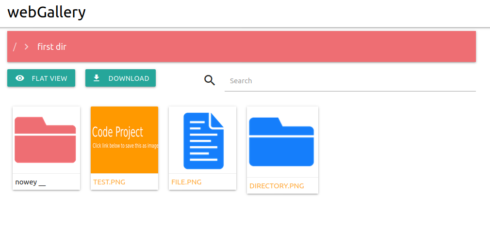

### What is it?
It's a simple web app made to show content on my OMV server.

### How to run it?
Easiest way to run is using docker container. 

`docker pull marekw96/webgallery`

`docker run -b path_to_dir_on_host:/webGallery/content -p 80:5000 -d webGallery`

Then it will be available on port 80 and shows _path_to_dir_on_host_

### How it looks like?

### Used components
* flask
* docker
* materializecss
* lightbox2
* Vue.js 
* Vue-lazy

### Few words at the end
Feel free to use it. Due to lack of permission and possibly some security flaws should be used only in intranet.